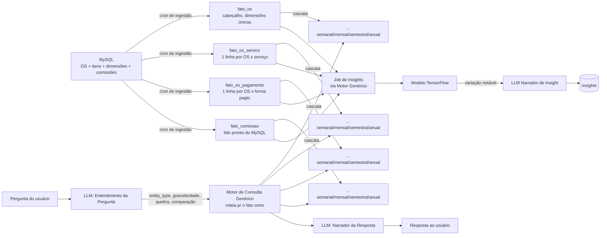
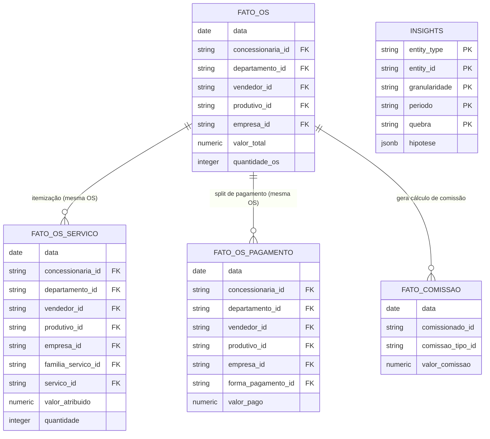

# Documento de Arquitetura de Software (SAD)

## 0. Stack Tecnológico
| Camada | Tecnologia | Papel |
|---|---|---|
| Origem dos dados | **MySQL** | OS, itens, comissões, cadastros (fonte de verdade das dimensões) |
| Destino dos fatos | **Postgres** | `fato_*` + snapshots `dim_*` (id/nome) + `insights` |
| Ingestão e cascata | **CLI / execução manual** (por hora nesta fase; Airflow/SO `[PENDENTE]` para produção) | Lê MySQL → grava fatos e sync `dim_*` no Postgres |
| Motor de consulta genérico | **Python + SQL parametrizado** | Monta e executa as consultas de agregação, comparação e ranking em tempo de leitura, usando mapas fixos como allowlist |
| Detecção de insights | **TensorFlow** | Autoencoder / rede recorrente-atenção / clusterização sobre séries reconstruídas pelo motor genérico |
| Entendimento de pergunta e narração | **LLM** (provedor a definir) | Traduz pergunta em parâmetros de consulta; narra o resultado e os insights em linguagem natural |
| Contrato | **YAML versionado** | Allowlist de `entity_types`, famílias de fato, quebras e comparações válidas |

## 1. Visão Geral
Uma OS tem dimensões de dois tipos: **únicas por OS** (concessionária, departamento, vendedor, empresa) e **multivaloradas** (serviço, **produtivo** e forma de pagamento). O produtivo vem de `os_servicos.produtivo_id` (item a item): uma OS com dois serviços pode ter dois produtivos. Forçar tudo numa linha só soma valor errado sempre que uma OS tem mais de um serviço, produtivo ou forma de pagamento. A correção é separar em **três famílias de fato**, cada uma com sua própria cascata por tempo:




## 2. Modelo de Dados (DER)



> As três famílias de fato (`FATO_OS`, `FATO_OS_SERVICO`, `FATO_OS_PAGAMENTO`) carregam concessionária, departamento, vendedor e empresa de forma redundante — cada uma é autossuficiente para seu próprio `GROUP BY`. Em `FATO_OS`, `produtivo_id` é sentinela `''` (produtivo **não** é único por OS). Em `FATO_OS_SERVICO`, `produtivo_id` vem de `os_servicos`, `familia_servico_id` aponta para **`subgrupos_servicos`** e `servico_id` para o serviço unitário. `forma_pagamento_id` só existe em `FATO_OS_PAGAMENTO`. **Cruzar serviço com forma de pagamento** (ex.: "quanto de Filme Solar foi pago no PIX") não é suportado: a origem guarda serviços e formas de pagamento como duas listas independentes por OS — cruzar as duas exigiria alocar valor arbitrariamente.


## 3. Camada 1 — Fatos Diários (três famílias, dimensões únicas redundantes)
```sql
CREATE TABLE fato_os_diario (
    data DATE NOT NULL,
    concessionaria_id TEXT, departamento_id TEXT, vendedor_id TEXT, produtivo_id TEXT, empresa_id TEXT,
    valor_total NUMERIC NOT NULL,
    quantidade_os INTEGER,
    PRIMARY KEY (data, concessionaria_id, departamento_id, vendedor_id, produtivo_id, empresa_id)
);

CREATE TABLE fato_os_servico_diario (
    data DATE NOT NULL,
    concessionaria_id TEXT, departamento_id TEXT, vendedor_id TEXT, produtivo_id TEXT, empresa_id TEXT,
    familia_servico_id TEXT NOT NULL,  -- subgrupos_servicos.id
    servico_id TEXT NOT NULL,           -- servicos.id (grão serviço a serviço)
    valor_atribuido NUMERIC NOT NULL,
    quantidade INTEGER,
    PRIMARY KEY (data, concessionaria_id, departamento_id, vendedor_id, produtivo_id, empresa_id, familia_servico_id, servico_id)
);

CREATE TABLE fato_os_pagamento_diario (
    data DATE NOT NULL,
    concessionaria_id TEXT, departamento_id TEXT, vendedor_id TEXT, produtivo_id TEXT, empresa_id TEXT,
    forma_pagamento_id TEXT NOT NULL,
    valor_pago NUMERIC NOT NULL,
    PRIMARY KEY (data, concessionaria_id, departamento_id, vendedor_id, produtivo_id, empresa_id, forma_pagamento_id)
);
```
`SUM(valor_atribuido)` em `fato_os_servico_diario`, agrupado por OS, deve bater com `valor_total` de `fato_os_diario` para a mesma OS — essa reconciliação é uma checagem de qualidade de dado na ingestão, não uma regra do banco. O mesmo vale para `fato_os_pagamento_diario`.

## 4. Camada 2 — Cascata por Tempo (cada família, independente)
Cada granularidade (`_semanal`, `_mensal`, `_semestral`, `_anual`) soma **sempre** o `*_diario` no intervalo do calendário — **não** encadeia semana→mês (pagamentos/eventos no fim do mês não devem distorcer a cadeia via semana). Quatro famílias, mesmo padrão:
```
fato_os_semanal        ← SUM(fato_os_diario) no intervalo da semana ISO
fato_os_mensal         ← SUM(fato_os_diario) no mês civil
fato_os_servico_*      ← idem a partir de fato_os_servico_diario
fato_os_pagamento_*    ← idem a partir de fato_os_pagamento_diario
fato_comissao_*        ← idem a partir de fato_comissao_diario
```
Completude **parcial** (soma os dias presentes). Default **insert-only**; `--force` reinsere o período. Detalhe: `14-fase2-cascata.md`.

## 5. Camada 3 — Fato de Comissão (componentes da origem + soma simples)
Comissão **não é recalculada** por percentual/faixa neste projeto — os componentes já existem em `comissoes` no MySQL. A ingestão aplica apenas a **soma simples** desses campos em `valor_comissao` (RF04). `fato_comissao` é alvo de ingestão com o mesmo padrão de idempotência de `fato_os`:
```sql
CREATE TABLE fato_comissao_diario (
    data DATE NOT NULL,
    comissionado_id TEXT NOT NULL,   -- comissoes.comissionado_id
    comissao_tipo_id TEXT NOT NULL,  -- comissoes.comissao_tipo_id → comissao_tipos
    valor_comissao NUMERIC NOT NULL,
    PRIMARY KEY (data, comissionado_id, comissao_tipo_id)
);
```
O cron lê `comissoes` (satélites: `comissao_tipos`, `comissao_periodos`, `comissao_pagamentos`) e grava aqui. Cascata por tempo se aplica do mesmo jeito.

Mapeamento confirmado no levantamento (`12-levantamento-fase-0.md`):
- `comissionado_id` ← `comissoes.comissionado_id` (mesmo nome da origem)
- `comissao_tipo_id` ← `comissoes.comissao_tipo_id` (sempre preenchido quando há comissionado; **não** derivar de `funcionario_tipos`/cargo — concessionária/indicador não têm cargo)
- `valor_comissao` ← soma simples dos componentes pré-calculados: `COALESCE(valor_dentro,0)+COALESCE(valor_fora,0)+COALESCE(valor_combo,0)+COALESCE(valor_compensado_permuta,0)+COALESCE(comissao_couro,0)` — **não** é “zero transformação”, mas também **não** é recálculo de regra de negócio
- Momento: comissão geral no **pagamento**; comissão do **produtivo** ao **fechar itens** — OS fechada sem comissão é esperado; não assumir 1:1 com fechada derivada
- Estados da OS para ingestão: ver `10-dicionario-dados.md` (paga / fechada derivada / cancelada por flag; `paga=1` sem `caixas` é inconsistência); não usar `os.finalizada` como paga∩fechada

## 6. Camada 4 — Contrato (agora também roteia para a família de fato certa)
```yaml
entity_types:
  concessionaria: { fato: fato_os, coluna: concessionaria_id, valor: valor_total, quebras_validas: [departamento, vendedor, empresa] }
  departamento:   { fato: fato_os, coluna: departamento_id,   valor: valor_total, quebras_validas: [concessionaria, vendedor, empresa] }
  vendedor:       { fato: fato_os, coluna: vendedor_id,       valor: valor_total, quebras_validas: [concessionaria, departamento, empresa] }
  produtivo:      { fato: fato_os_servico, coluna: produtivo_id, valor: valor_atribuido, quebras_validas: [concessionaria, departamento, servico, familia_servico, vendedor, empresa] }
  empresa:        { fato: fato_os, coluna: empresa_id,        valor: valor_total, quebras_validas: [concessionaria, departamento, vendedor] }
  familia_servico: { fato: fato_os_servico, coluna: familia_servico_id, valor: valor_atribuido, quebras_validas: [concessionaria, departamento, servico, produtivo] }
  servico:        { fato: fato_os_servico, coluna: servico_id, valor: valor_atribuido, quebras_validas: [concessionaria, departamento, familia_servico, produtivo] }
  forma_pagamento: { fato: fato_os_pagamento, coluna: forma_pagamento_id, valor: valor_pago, quebras_validas: [concessionaria, departamento] }
  comissao_vendedor: { fato: fato_comissao, coluna: comissionado_id, valor: valor_comissao, filtro_fixo: {comissao_tipo_id: ["2"]}, resolve_dim: dim_funcionario }
  comissao_produtivo: { fato: fato_comissao, coluna: comissionado_id, valor: valor_comissao, filtro_fixo: {comissao_tipo_id: ["3"]}, resolve_dim: dim_funcionario }
  comissao_concessionaria: { fato: fato_comissao, coluna: comissionado_id, valor: valor_comissao, filtro_fixo: {comissao_tipo_id: ["1"]}, resolve_dim: dim_concessionaria }
  comissao_indicador: { fato: fato_comissao, coluna: comissionado_id, valor: valor_comissao, filtro_fixo: {comissao_tipo_id: ["4","5"]}, resolve_dim: dim_indicador }
  comissao_tipo:  { fato: fato_comissao, coluna: comissao_tipo_id, valor: valor_comissao, quebras_validas: [] }
```
Arquivo vivo: `contrato.yaml`. CLI: `python -m faceta.query` — ver `15-fase3-consulta.md`.  
Note que `servico` e `forma_pagamento` **não aparecem como quebra válida um do outro** — reflete a limitação da seção 2 (sem itemização cruzada na origem, essa combinação não existe).

## 7. Motor de Consulta Genérico
```python
DIMENSAO_TO_COLUNA = {
    "concessionaria": "concessionaria_id", "departamento": "departamento_id",
    "vendedor": "vendedor_id", "produtivo": "produtivo_id",
    "familia_servico": "familia_servico_id", "servico": "servico_id", "forma_pagamento": "forma_pagamento_id",
}
GRANULARIDADE_SUFIXO = {"diario": "_diario", "semanal": "_semanal", "mensal": "_mensal",
                        "semestral": "_semestral", "anual": "_anual"}

def tabela(entity_type, granularidade, contrato):
    fato_base = contrato["entity_types"][entity_type]["fato"]   # ex.: 'fato_os_servico'
    return fato_base + GRANULARIDADE_SUFIXO[granularidade]        # ex.: 'fato_os_servico_mensal'
```
```sql
SELECT {coluna_entity_id} AS entity_id, SUM({coluna_valor}) AS valor
FROM {tabela_resolvida}
WHERE data/periodo = :periodo [AND {coluna_quebra} = :quebra_valor]
GROUP BY {coluna_entity_id} [, {coluna_quebra}];
```
`{coluna_valor}` também vem do contrato (`valor_total`, `valor_atribuido` ou `valor_pago`, conforme a família). O roteamento pra tabela certa acontece automaticamente a partir do `entity_type` — o LLM de entendimento de pergunta nunca precisa saber que existem três famílias de fato, só devolve `entity_type`.

## 8. Comparações e Ranking (tempo de leitura, mesma lógica de antes)
Sem mudança de princípio — a mesma consulta roda duas vezes (período pedido + período de referência) para comparações, e sem filtro de `entity_id` com `RANK()` para ranking. A única diferença é que agora a consulta pode mirar em qualquer uma das três famílias, resolvida pelo contrato.

## 9. Entendimento de Pergunta
Sem mudança de princípio: LLM traduz a pergunta em `entity_type`, `entity_id` (opcional), `granularidade`, `periodo`, `quebra`, `comparacao`. A resolução de qual família de fato consultar é interna do motor genérico (seção 7), nunca exposta à camada de entendimento.

## 10. Insights (deep learning, roda em lote)
Mesmo desenho de antes — reconstrói série via motor genérico, aplica TensorFlow, narra condicionalmente, cacheia em `insights`. Agora o job de insights também pode olhar `fato_comissao` como uma quarta fonte de série (ex.: detectar comissão fora do padrão).

## 11. Projeto Independente
Este sistema não reutiliza nem depende do `orion_v3` — é um projeto novo, com base de dados, contrato e pipeline próprios. Não há fallback nem convivência operacional entre os dois.
